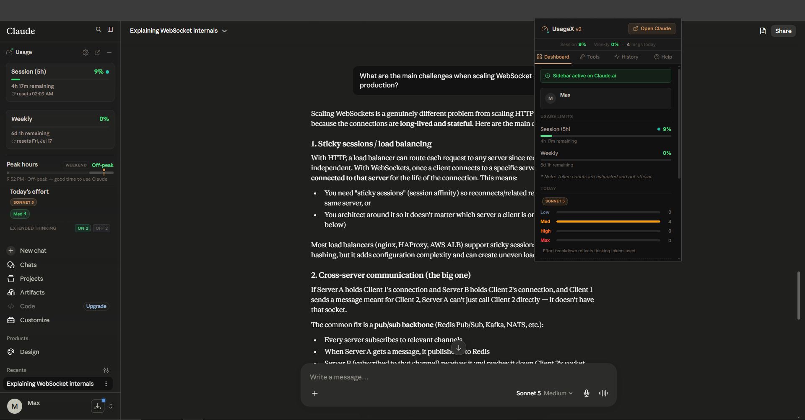
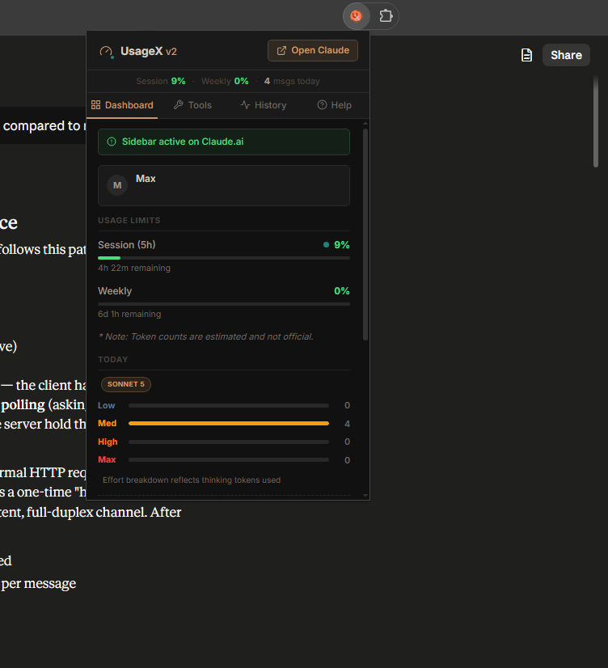
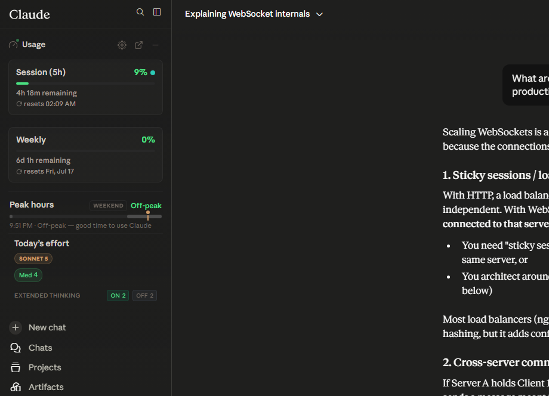

# UsageX v2

[](https://usagex.carrd.co/)
[](https://addons.mozilla.org/en-US/firefox/addon/usagex/)



> A Firefox (Manifest V3) extension that tracks your **Claude.ai** usage and renders a live stats panel directly on the page — no external server, no third-party libraries, no build step required.

---

## Features

### Dashboard
- **Session & Weekly usage bars** — real-time percentage consumed from Claude's 5-hour and 7-day token windows, read straight from the API response. Hover a bar to see the raw token count and limit.
- **Usage rate indicator** — a colour-coded pulsing dot next to the session bar that shows your token burn rate per hour:
  - Teal — below normal (`< 19%/h`) · great pace
  - Gray — on track (`~20%/h`)
  - Amber — above normal (`> 21%/h`)
  - Orange — burning fast (`>= 30%/h`) · slow down!
- **Live header dot** — shows server load in real time (teal = off-peak, red = peak hours 6:30 PM – 12:30 AM IST).
- **Reset countdowns** — live display of time remaining until session and weekly limits reset.
- **Peak-hours hint** — a banner that appears during high-traffic hours to warn that limits deplete faster.

### Today Section
- **Effort breakdown** — tracks how many messages were sent at each thinking level (Low / Medium / High / Max) with per-level progress bars.
- **Extended Thinking toggle stats** — counts prompts sent with Extended Thinking ON vs. OFF (shown for models that support the toggle, e.g. Sonnet 4/5, Opus 4, Haiku 4.5).
- **Model tracking** — displays which Claude models were used today as labelled pills (Sonnet, Opus, Haiku, Fable, Mythos, and version-specific variants).
- **Daily stat cards** — messages sent, active time, total estimated tokens, and average tokens per message.
- **7-Day Token Trend** — interactive sparkline chart showing estimated daily token usage over the last 7 days; hover a bar for the exact value.

### History Tab
- **30-Day usage heatmap** — GitHub-style activity grid showing token usage intensity for the last 30 days, with daily averages, active-day count, and peak-day summary.
- **Top Conversations** — lists the 5 conversations with highest estimated token cost.
- **Daily log** — scrollable list of past daily stats stored in a local IndexedDB database.

### Popup Dashboard


- **Quick stats strip** — session %, weekly %, and messages sent today shown immediately at the top.
- **Active account card** — displays the logged-in account name, email, and Claude plan (Free / Pro / Max).
- **Multi-account support** — data is namespaced per account; switching accounts in Claude is detected automatically.
- **Alert threshold sliders** — set custom warning levels (50 – 95%) for both session and weekly usage.
- **Export JSON** — one-click export of all stored stats.
- **Reset Stats / Clear Logs** — danger-zone buttons with confirmation.
- **Debug log viewer** — inline badge showing the current log count; opens the standalone `debug-viewer.html` page.
- **In-app feedback form** — report bugs, request features, or ask questions directly from the Help tab; optionally attaches diagnostic info.

### Sidebar Integration



### Sidebar Panel (on Claude.ai)
- **Messages-remaining estimate** — derived from your average token cost per message in the current 5-hour session.
- **Peak-hours clock** — a 24-hour timeline strip highlighting the 6:30 PM – 12:30 AM IST window.
- **Minimise / float / resize** — dock the panel in the Claude sidebar (left or right), detach it as a floating widget, or resize it freely.
- **Keyboard shortcut** — `Alt+U` toggles the panel open/closed from anywhere on the page.

### Privacy & Storage
- **Privacy-first** — all data is stored in a local, sandboxed IndexedDB database on your machine.
- **Zero automatic network calls** — the extension itself never contacts any external server. (The optional feedback form is the only outbound call, and it is user-initiated.)
- **No analytics, trackers, cookies, or telemetry.**

---

## How It Works

```
Claude page fetch()
        |
   inject.js  (MAIN world)          <- intercepts window.fetch
        |  postMessage
        v
   content.js (ISOLATED world)      <- parses usage limits & messages, renders sidebar
        |  browser.storage.local
        v
   background.js                    <- midnight reset alarm, account mirroring, feedback relay
        |
   db.js (IndexedDB)                <- persistent daily_stats & convo_stats storage
```

| File | Role |
|---|---|
| `manifest.json` | Extension manifest (MV3, Firefox-first with Chrome compat shim) |
| `content.js` | Core logic: sidebar injection, UI updates, event binding, usage-rate calc, toast notifications |
| `background.js` | Service worker: midnight data roll-over, account-key mirroring, reset alarms, feedback relay |
| `inject.js` | MAIN-world fetch hook; posts usage data & message bodies to `content.js` via `postMessage` |
| `inject-loader.js` | Content script (isolated world) that appends `inject.js` as a page-level `<script>` tag |
| `db.js` | IndexedDB wrapper: `daily_stats` & `convo_stats` stores, migration from `storage.local` |
| `popup.html/css/js` | Toolbar popup: dashboard, history, tools, and help tabs |
| `permissions.html/js` | One-time permission request page for browser notifications |
| `debug-viewer.html/css/js` | Standalone page for inspecting stored debug logs |
| `icons/` | Extension icons (16 x 16, 48 x 48, 128 x 128) |

---

## Installation

### Firefox (recommended)

Install directly from the official listing — no restart required:

**[Add to Firefox](https://addons.mozilla.org/en-US/firefox/addon/usagex/)**

Or load it as a temporary add-on from source:

1. Open Firefox and navigate to `about:debugging#/runtime/this-firefox`.
2. Click **Load Temporary Add-on…**
3. Select the `manifest.json` file inside this folder.
4. Open [https://claude.ai/](https://claude.ai/) — the sidebar panel appears automatically.

> **Note:** Temporary add-ons loaded from source are removed when Firefox restarts.

### Chrome / Edge (developer mode)

1. Go to `chrome://extensions` (or `edge://extensions`).
2. Enable **Developer mode** (toggle, top-right).
3. Click **Load unpacked** and select this folder.
4. Open [https://claude.ai/](https://claude.ai/).

> The extension uses `var browser = chrome` as a compatibility shim when the `browser` global is absent, so it works in Chromium browsers without modification.

---

## Permissions

| Permission | Why |
|---|---|
| `storage` | Saves settings and live keys (`today`, `usage_limits`, `user_email`, etc.) locally |
| `alarms` | Schedules session/weekly reset-approaching and reset notifications |
| `tabs` | Opens the debug viewer and permissions page in a new tab |
| `notifications` | Shows browser-native reset alerts (only when explicitly enabled by the user in Settings) |
| `host_permissions: claude.ai` | Allows the content script and fetch hook to run on Claude |
| `host_permissions: script.google.com` | Used only for the optional user-initiated feedback form submission |

---

## Settings

Open the gear icon in the sidebar header to access:

| Setting | Description |
|---|---|
| **Sidebar side** | Dock the panel on the left or right of Claude's nav sidebar |
| **Floating mode** | Detach the panel — drag the header to reposition it freely |
| **Opacity** | Control floating-widget transparency (10 – 100%) |
| **Resizable** | Enable drag-to-resize handles on the floating panel |
| **Timezone** | Override the timezone used for reset-time display (defaults to browser locale) |
| **Debug logging** | Toggle verbose event logging (stored in `browser.storage.local`) |
| **Browser notifications** | Opt in to OS-level reset alerts via `browser.notifications` |
| **Toast notifications** | In-page toast alerts for usage thresholds and peak-hours warnings |
| **Toast position** | Choose where toasts appear (bottom-right, top-right, etc.) |

Alert thresholds (50 – 95%) for session and weekly usage can be set from the **Tools** tab in the popup.

---

## Notes

- Token counts are intentionally approximate and labelled `~est` in the UI. Claude does not expose exact token counts in the browser API; input length is estimated from character count (`chars / 4`) and thinking tokens are estimated per effort level.
- The sidebar uses no Shadow DOM; it injects directly into the Claude nav element and is fully styled with scoped CSS custom properties (`--ux-*`) to avoid leaking into or inheriting from Claude's own styles.
- No build step is required. All code is plain JavaScript (ES2020+) and runs directly in the browser.
- Data previously stored in `browser.storage.local` is automatically migrated to IndexedDB on first load; the `history` key is removed after migration.

---

## License

MIT

---

## AMO Review Notes

This section is intended for Mozilla reviewers.

### Why is `inject.js` in `web_accessible_resources`?

The extension intercepts Claude's `window.fetch` calls to read usage-limit data from API responses. This requires running code in the **MAIN world** (the page's own JavaScript context), not the isolated content-script world, so that the overridden `fetch` shares the same `window` object as Claude's own code.

The established MV3 pattern for this is:
1. `inject-loader.js` (content script, isolated world) appends a `<script src="inject.js">` tag to the page.
2. `inject.js` (MAIN world) overrides `window.fetch`, reads the response body, and forwards only the relevant numeric fields (`utilization`, `resets_at`) back to the content script via `window.postMessage`.

For step 1 to work, `inject.js` must be listed in `web_accessible_resources` so the browser permits its URL to be loaded as a page script. All `postMessage` messages are validated with a shared secret and a strict origin allowlist (`https://claude.ai` only) before being acted upon.

The other resources listed (`popup.html/css/js`, `debug-viewer.*`, `permissions.*`) are opened via `browser.runtime.getURL` from within the extension context and therefore also require `web_accessible_resources` entries.

### What is stored in `recent_sent_prompts`?

`recent_sent_prompts` contains a rolling window of **djb2 hashes** (32-bit unsigned integers encoded as base-36 strings) of the user's outgoing message text. The hashes are one-way — the original text cannot be recovered from them. They are stored locally in IndexedDB and used exclusively to prevent double-counting when the conversation-history sync replays messages that were already counted in real-time. No message text, summary, or personally identifiable information is stored or transmitted.

### Feedback form network call

The Help tab in the popup contains an optional, user-initiated feedback form. When submitted, the extension sends a `SUBMIT_FEEDBACK` message to `background.js`, which makes a single `POST` request to a Google Apps Script URL (`script.google.com`). This is the **only** outbound network call made by the extension, and it is triggered exclusively by an explicit user action. It is not used for analytics or telemetry.

### Debug Viewer (`debug-viewer.html`)

The debug viewer is an internal diagnostic page opened from the extension popup (via `browser.runtime.getURL`). It reads verbose event logs from `browser.storage.local` only when the user has explicitly enabled **Debug logging** in Settings. Debug logging is off by default and the log store is cleared by the user from within the viewer. No data leaves the device.
